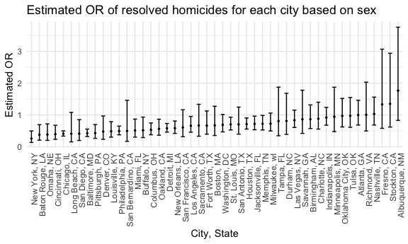
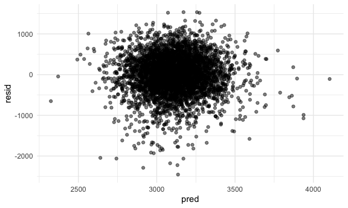
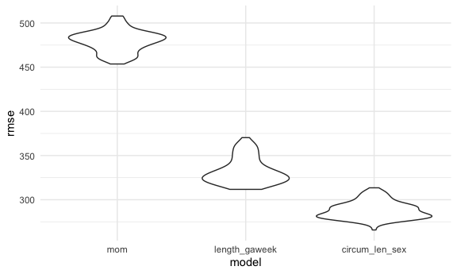

p8105_hw6_lg3239
================
Landi Guo
2022-12-01

## Problem 2

Load the dataset and created `city_state` and `disp_status` variables,
in which 0 is unresolved; 1 is resolved. `filter` based on the criteria.

``` r
wpost = read_csv("data/homicide-data.csv")
```

    ## Rows: 52179 Columns: 12
    ## ── Column specification ────────────────────────────────────────────────────────
    ## Delimiter: ","
    ## chr (9): uid, victim_last, victim_first, victim_race, victim_age, victim_sex...
    ## dbl (3): reported_date, lat, lon
    ## 
    ## ℹ Use `spec()` to retrieve the full column specification for this data.
    ## ℹ Specify the column types or set `show_col_types = FALSE` to quiet this message.

``` r
wpost =
  wpost %>%
  mutate(city_state = str_c(city, ", ", state)) %>%
  # 0: unresolved, 1: resolved
  mutate(disp_status = ifelse(disposition %in% c("Closed without arrest", "Open/No arrest"), 0, 1)) %>%
  filter(!city_state %in% c("Dallas, TX", "Phoenix, AZ", "Kansas City, MO", "Tulsa, AL")) %>%
  mutate(victim_age = as.numeric(victim_age)) %>%
  filter(victim_race %in% c("White", "Black"))
```

The result here shows that in Baltimore, MD, homicides in which the
victim is male is about 57.4% less likely to be resolved than those in
which the victim is female. The confidence interval is (0.325, 0.558)

``` r
baltimore_df =
  wpost %>%
  filter(city_state == "Baltimore, MD")

baltimore_glm =
  baltimore_df %>%
  glm(disp_status ~ victim_age + victim_race + victim_sex, data = ., family = binomial())

baltimore_glm %>%
  broom::tidy() %>% 
  mutate(confint_low = exp(estimate - std.error*1.96)) %>%
  mutate(confint_high = exp(estimate + std.error*1.96)) %>%
  mutate(OR = exp(estimate)) %>%
  select(term, log_OR = estimate, OR, confint_low, confint_high) %>%
  filter(term == "victim_sexMale")
```

    ## # A tibble: 1 × 5
    ##   term           log_OR    OR confint_low confint_high
    ##   <chr>           <dbl> <dbl>       <dbl>        <dbl>
    ## 1 victim_sexMale -0.854 0.426       0.325        0.558

The following runs `glm` on each city with resolved vs unresolved as the
outcome and victim age, sex and race as predictors. `nest` everything
except city and then use `map` to apply `glm` on each city’s data. Then
`broom::tidy` and `unnest` the model result, and manually calculate the
CIs and adjusted OR using `exp`. Retain rows for term is
`victim_sexMale`.

``` r
city_results =
  wpost %>%
  nest(data = -city_state) %>%
  mutate(model = map(data, ~glm(disp_status ~ victim_age + victim_race + victim_sex, data = .x, family = binomial()))) %>%
  mutate(model = map(model, broom::tidy)) %>%
  unnest(model) %>%
  filter(term == "victim_sexMale") %>%
  mutate(confint_low = exp(estimate - std.error*1.96),
         confint_high = exp(estimate + std.error*1.96),
         OR = exp(estimate)) %>%
  select(city_state, term, log_OR = estimate, OR, confint_low, confint_high)

head(city_results)
```

    ## # A tibble: 6 × 6
    ##   city_state      term               log_OR    OR confint_low confint_high
    ##   <chr>           <chr>               <dbl> <dbl>       <dbl>        <dbl>
    ## 1 Albuquerque, NM victim_sexMale  0.570     1.77        0.831        3.76 
    ## 2 Atlanta, GA     victim_sexMale  0.0000771 1.00        0.684        1.46 
    ## 3 Baltimore, MD   victim_sexMale -0.854     0.426       0.325        0.558
    ## 4 Baton Rouge, LA victim_sexMale -0.964     0.381       0.209        0.695
    ## 5 Birmingham, AL  victim_sexMale -0.139     0.870       0.574        1.32 
    ## 6 Boston, MA      victim_sexMale -0.395     0.674       0.356        1.28

This plot shows the estimated odds ratio and confidence intervals for
solving homicides comparing male victims to female victims in each city.
Homicides in which the victim is male are less likely to be resolved
than those in which the victim is female in most of the cities. In
Fresno, CA, Stockton, CA, and Albuquerque, NM, homicides in which the
victim is male are more likely to be resolved than those in which the
victim is female.

``` r
city_results %>%
  mutate(city_state = fct_reorder(city_state, OR)) %>%
  ggplot(aes(x = city_state, y = OR)) +
  geom_point(size = 0.5) +
  geom_errorbar(aes(ymin = confint_low, ymax = confint_high), width = 0.5) +
  theme(axis.text.x = element_text(angle = 90, hjust = 1)) +
  labs(
    x = "City, State",
    y = "Estimated OR",
    title = "Estimated OR of resolved homicides for each city based on sex"
  )
```



## Problem 3

For cleaning, only convert the sex variable from numeric to character;
there is no missing value.

``` r
weight_df = read_csv("data/birthweight.csv")
```

    ## Rows: 4342 Columns: 20
    ## ── Column specification ────────────────────────────────────────────────────────
    ## Delimiter: ","
    ## dbl (20): babysex, bhead, blength, bwt, delwt, fincome, frace, gaweeks, malf...
    ## 
    ## ℹ Use `spec()` to retrieve the full column specification for this data.
    ## ℹ Specify the column types or set `show_col_types = FALSE` to quiet this message.

``` r
weight_df = 
  weight_df %>%
  mutate(babysex = ifelse(babysex == 1, "Male", "Female"))
```

For the outcome of baby’s birth weight, I choose to use `wtgain`
mother’s weight gain during pregnancy, `momage` mother’s age at
delivery, and `mheight` mother’s height as predictors. I hypothesize
that mother’s weight gain during pregnancy is related to baby’s birth
weight because it is also giving the baby food/nutrients; mother’s age
at delivery might affect the health of the baby; mother’s height and
baby’s height might be related and for taller baby, heavier baby. This
is the linear model for above predictors.

``` r
lm_mom = lm(bwt ~ wtgain + momage + mheight, data = weight_df)
lm_mom %>% broom::tidy()
```

    ## # A tibble: 4 × 5
    ##   term        estimate std.error statistic  p.value
    ##   <chr>          <dbl>     <dbl>     <dbl>    <dbl>
    ## 1 (Intercept)    463.    176.         2.62 8.75e- 3
    ## 2 wtgain          11.8     0.673     17.5  2.62e-66
    ## 3 momage          18.5     1.91       9.69 5.34e-22
    ## 4 mheight         31.8     2.78      11.4  8.07e-30

This is the residual vs. fitted value plot for my chosen predictors. Use
`add_residuals` and `add_predictions` for residuals and fitted points.

``` r
res = 
  modelr::add_residuals(weight_df, lm_mom) %>%
  select(resid)

fitted = 
  modelr::add_predictions(weight_df, lm_mom) %>%
  select(pred)

bind_cols(res, fitted) %>%
  ggplot(aes(x = pred, y = resid)) +
  geom_point(alpha = 0.5)
```



This is the model using length at birth and gestational age as
predictors.

``` r
lm_1 = lm(bwt ~ blength + gaweeks, data = weight_df)
lm_1 %>% broom::tidy()
```

    ## # A tibble: 3 × 5
    ##   term        estimate std.error statistic  p.value
    ##   <chr>          <dbl>     <dbl>     <dbl>    <dbl>
    ## 1 (Intercept)  -4348.      98.0      -44.4 0       
    ## 2 blength        129.       1.99      64.6 0       
    ## 3 gaweeks         27.0      1.72      15.7 2.36e-54

This is the model using head circumference, length, sex, and all
interactions (including the three-way interaction) between these.

``` r
lm_2 = lm(bwt ~ (bhead + blength + babysex)^3, data = weight_df)
lm_2 %>% broom::tidy()
```

    ## # A tibble: 8 × 5
    ##   term                      estimate std.error statistic    p.value
    ##   <chr>                        <dbl>     <dbl>     <dbl>      <dbl>
    ## 1 (Intercept)                -802.    1102.       -0.728 0.467     
    ## 2 bhead                       -16.6     34.1      -0.487 0.626     
    ## 3 blength                     -21.6     23.4      -0.926 0.354     
    ## 4 babysexMale               -6375.    1678.       -3.80  0.000147  
    ## 5 bhead:blength                 3.32     0.713     4.67  0.00000317
    ## 6 bhead:babysexMale           198.      51.1       3.88  0.000105  
    ## 7 blength:babysexMale         124.      35.1       3.52  0.000429  
    ## 8 bhead:blength:babysexMale    -3.88     1.06     -3.67  0.000245

This is the cross validation comparison for the three models. The result
shows that my chosen predictors model has highest rmse and the model
using head circumference, length, sex, and all interactions has the
least rmse and the best fit.

``` r
cv_df =
  crossv_mc(weight_df, 100) %>%
  mutate(train = map(train, as_tibble),
         test = map(test, as_tibble)) %>%
  mutate(lm_mom = map(train, ~lm(bwt ~ wtgain + momage + mheight, data = .x)),
         lm_1 = map(train, ~lm(bwt ~ blength + gaweeks, data = .x)),
         lm_2 = map(train, ~lm(bwt ~ (bhead + blength + babysex)^3, data = .x))) %>%
  mutate(rmse_mom = map2_dbl(lm_mom, test, ~rmse(model = .x, data = .y)),
         rmse_length_gaweek = map2_dbl(lm_1, test, ~rmse(model = .x, data = .y)),
         rmse_circum_len_sex = map2_dbl(lm_2, test, ~rmse(model = .x, data = .y)))

cv_df %>% 
  select(starts_with("rmse")) %>% 
  pivot_longer(
    everything(),
    names_to = "model", 
    values_to = "rmse",
    names_prefix = "rmse_") %>% 
  mutate(model = fct_inorder(model)) %>% 
  ggplot(aes(x = model, y = rmse)) +
  geom_violin()
```


